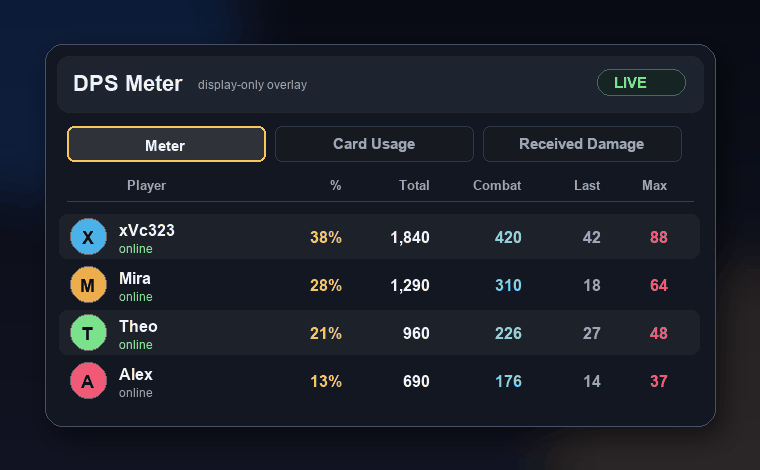

# DPS Meter for Slay the Spire 2

DPS Meter is a local, English-only Slay the Spire 2 overlay mod. It is designed for direct local install instead of Steam Workshop distribution. It shows each player's damage for the current combat and for the whole run.

It is explicitly display-only:

```json
"affects_gameplay": false
```

<p align="center">
  
</p>

STS2 only blocks multiplayer joins when **gameplay-affecting** mods differ. DPS Meter is a non-gameplay UI overlay, so mismatches with unmodded players are allowed by the game's multiplayer compatibility check.

## Features

- Current-combat damage per player
- Total run damage per player
- Last hit and max hit values, including grouped multi-hit / multi-target card damage
- Card Usage and Received Damage tabs
- Draggable in-game Godot overlay
- DLL-only install; no separate `.pck` is required
- Compact and side-hidden UI states
- English UI text only

## Quick install from GitHub

The installer downloads `DPSMeter.zip` from the latest GitHub Release unless `DPSMETER_PACKAGE` points at a local zip.

Install requirements:

- Slay the Spire 2 installed locally through Steam or at a path passed with `STS2_DIR`.
- The game must be fully closed while installing or uninstalling.
- macOS: `bash`, `curl`, and `unzip` available in Terminal. These are normally built into macOS.
- Windows: PowerShell and internet access to GitHub releases.

If Steam is installed in a custom library on macOS, run:

```bash
curl -fsSL https://raw.githubusercontent.com/xvc323/DPSmeter/main/scripts/install-macos.sh | STS2_DIR="/path/to/Slay the Spire 2" bash
```

### macOS install

```bash
curl -fsSL https://raw.githubusercontent.com/xvc323/DPSmeter/main/scripts/install-macos.sh | bash
```

### macOS uninstall

```bash
curl -fsSL https://raw.githubusercontent.com/xvc323/DPSmeter/main/scripts/uninstall-macos.sh | bash
```

### Windows install

Open PowerShell and run:

```powershell
irm https://raw.githubusercontent.com/xvc323/DPSmeter/main/scripts/install-windows.ps1 | iex
```

### Windows uninstall

```powershell
irm https://raw.githubusercontent.com/xvc323/DPSmeter/main/scripts/uninstall-windows.ps1 | iex
```

## Save handling

The install and uninstall scripts **do not touch, copy, delete, symlink, or junction any saves**. They only install or remove the `mods/DPSMeter` folder.

STS2 stores modded and unmodded saves separately once any mod is loaded. Do **not** automate save sharing with symlinks or Windows junctions: Steam Cloud may treat the linked folder as real save data and overwrite progression in the other profile.

If you ever need to migrate progression between profiles, quit the game, disable Steam Cloud temporarily, make a manual backup first, and copy the relevant save files yourself.

## Build a release package

From a machine with Slay the Spire 2 installed:

```bash
scripts/package-release.sh
```

This creates:

```text
dist/DPSMeter.zip
```

The zip contains:

```text
DPSMeter.dll
DPSMeter.json
```

Upload `dist/DPSMeter.zip` to a GitHub Release. The install scripts download:

```text
https://github.com/xvc323/DPSmeter/releases/latest/download/DPSMeter.zip
```

## Manual install layout

Build or obtain these two files:

- `DPSMeter.dll`
- `DPSMeter.json`

### macOS manual path

STS2 reads local mods from the `mods` folder next to the game executable. On macOS the executable is inside the app bundle:

```text
Slay the Spire 2/SlayTheSpire2.app/Contents/MacOS/mods/DPSMeter/
```

Expected final layout:

```text
Slay the Spire 2/
  SlayTheSpire2.app/
    Contents/
      MacOS/
        mods/
          DPSMeter/
            DPSMeter.dll
            DPSMeter.json
```

### Windows manual path

STS2 uses the `mods` folder next to the Windows executable. The installer finds the executable and installs to:

```text
<folder containing Slay the Spire 2.exe>\mods\DPSMeter\
```

## Build requirements

The mod build references game assemblies from your local Slay the Spire 2 install. On this Mac, the default Steam path is detected automatically:

```text
~/Library/Application Support/Steam/steamapps/common/Slay the Spire 2/SlayTheSpire2.app/Contents/Resources/data_sts2_macos_arm64
```

Requirements:

- macOS or Windows
- .NET SDK 10
- Godot .NET SDK 4.5.1
- Slay the Spire 2 installed locally

Run:

```bash
dotnet build
```

If Steam is installed elsewhere, pass the path explicitly:

```bash
dotnet build -p:Sts2Dir="$HOME/Library/Application Support/Steam/steamapps/common/Slay the Spire 2"
```

## Local repository checks

```bash
python3 -m unittest discover -s tests -v
```

These checks validate the local mod identity, display-only manifest, English-only localization, documentation, installer safety contracts, and source invariants.

## Attribution

DPS Meter is based on the MIT-licensed `BAIGUANGMEI/STS2-DamageTracker` project:

https://github.com/BAIGUANGMEI/STS2-DamageTracker

The upstream MIT license is preserved in `LICENSE`, and attribution details are in `NOTICE`.
